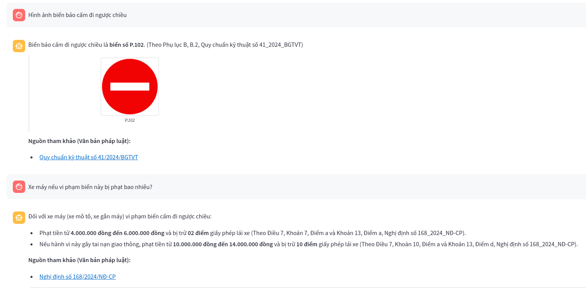
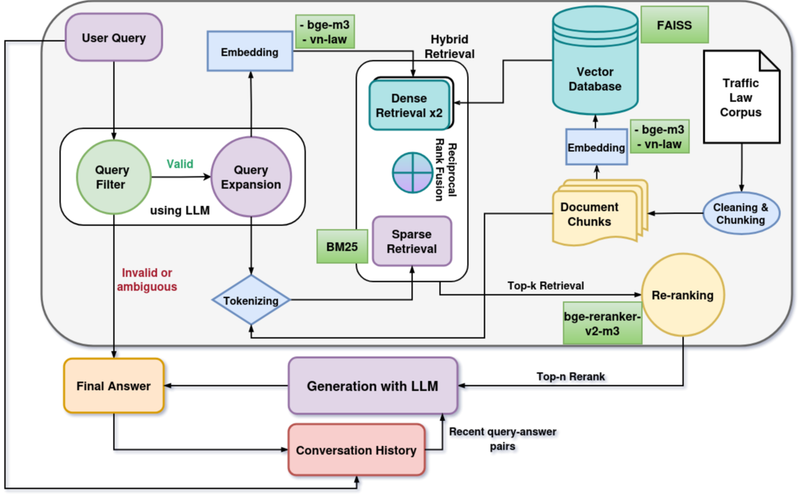

# Vietnam Traffic Law Chatbot

## 📑 Mục lục

- [Tính năng nổi bật](#tính-năng-nổi-bật)
- [Kiến trúc hệ thống (RAG Pipeline)](#kiến-trúc-hệ-thống-rag-pipeline)
- [Công nghệ sử dụng](#công-nghệ-sử-dụng)
- [Cấu trúc thư mục](#cấu-trúc-thư-mục)
- [Hướng dẫn cài đặt và sử dụng](#hướng-dẫn-cài-đặt-và-sử-dụng)
  - [Yêu cầu](#yêu-cầu)
  - [Cài đặt](#cài-đặt)
  - [Sử dụng](#sử-dụng)
- [Nguồn dữ liệu](#nguồn-dữ-liệu)
- [Giấy phép](#giấy-phép)

---

## 🌟 Tính năng nổi bật

- **Hệ thống RAG mạnh mẽ**: Kết hợp LLM (Google Gemini) với hệ thống truy xuất thông tin để trả lời câu hỏi dựa trên văn bản luật.
- **Truy vấn đa dạng (Hybrid Retrieval)**:
  - *Dense Retrieval*: Tìm kiếm ngữ nghĩa bằng vector embedding (FAISS).
  - *Sparse Retrieval*: Tìm kiếm từ khóa bằng BM25.
  - *Hybrid Retrieval*: Kết hợp cả hai bằng Rank-Fusion (RRF).
- **Mở rộng câu hỏi (Query Expansion)**: Tự động sinh biến thể câu hỏi bằng LLM, giúp cải thiện truy xuất.
- **Xếp hạng lại kết quả (Reranking)**: Sử dụng Cross-Encoder để đánh giá và sắp xếp tài liệu liên quan.
- **Hiển thị biển báo giao thông**: Nhận diện và hiển thị hình ảnh biển báo nếu được đề cập trong văn bản luật.
- **Giao diện tùy chỉnh linh hoạt**: Xây dựng bằng Streamlit, cho phép:
  - Tùy chọn mô hình Embedding, Reranker, Generative.
  - Thay đổi phương thức truy vấn, chế độ trả lời.
- **Trang đánh giá hiệu suất**: Đánh giá hệ thống với các metric: Precision@k, Recall@k, F1@k, MRR@k, NDCG@k.
- **Kiến trúc module hóa**: Dễ bảo trì, mở rộng.

---

## 🧠 Kiến trúc hệ thống (RAG Pipeline)

1. **Query Expansion**: Sử dụng Gemini để tạo các biến thể câu hỏi nếu hợp lệ.
2. **Information Retrieval**: Truy xuất tài liệu từ FAISS (Dense) và BM25 (Sparse).
3. **Reranking**: Dùng Cross-Encoder để đánh giá độ liên quan và sắp xếp lại tài liệu.
4. **Answer Generation**: Dựa trên tài liệu đã sắp xếp, sinh câu trả lời bằng Gemini.

---

## 🛠️ Công nghệ sử dụng

- **Framework**: Streamlit
- **LLM**: Google Gemini (`google-generativeai`)
- **Embedding / Reranking**: `Sentence Transformers`, `BAAI/bge-m3`, `bge-reranker-v2-m3`
- **Vector DB**: FAISS
- **Sparse Retrieval**: `rank_bm25`
- **NLP Tools**: `pyvi`, `py-vncorenlp`
- **Khác**: `NumPy`, `Pandas`

---

## 📁 Cấu trúc thư mục

```
Vietnam-Traffic-Law-Chatbot/
├── chatbot/              # Mã nguồn chính
│   ├── pages/            # Trang con (vd: Evaluation.py)
│   ├── Chatbot.py        # File chạy chính
│   ├── config.py         # Cấu hình mô hình, tham số
│   ├── data_loader.py    # Tải dữ liệu
│   ├── generation.py     # Sinh câu trả lời
│   ├── model_loader.py   # Tải các mô hình
│   ├── reranker.py       # Xếp hạng lại
│   ├── retriever.py      # Truy xuất Dense/Sparse/Hybrid
│   ├── utils.py          # Tiện ích, metrics
│   └── vector_db.py      # Quản lý FAISS DB
├── datasets/             # Bộ dữ liệu đã xử lý
├── loader/               # Tải dữ liệu thô
├── make_datasets/        # Xử lý dữ liệu gốc
├── notebook/             # Thử nghiệm Jupyter
├── text/                 # Văn bản luật gốc
├── traffic_sign/         # Ảnh biển báo
├── .gitignore
├── README.md
└── requirements.txt
```

---

## 🧪 Hướng dẫn cài đặt và sử dụng

### Yêu cầu

- **Kaggle Notebook** hoặc môi trường tương đương hỗ trợ `streamlit`, `ngrok`, và cài thư viện bằng pip.
- **GOOGLE_API_KEY**: API key của mô hình Google Gemini.
- **NGROK_AUTH_TOKEN**: Token từ tài khoản [ngrok.com](https://dashboard.ngrok.com/get-started/your-authtoken) để khởi tạo đường hầm.
- Đảm bảo cả hai đều được lưu trong `Kaggle Secrets` với tên lần lượt là:
  - `GOOGLE_API_KEY`
  - `NGROK_AUTH_TOKEN`

---

### Cài đặt (trên Kaggle)

```python
# Tải project từ GitHub
!git clone https://github.com/leeminsun1205/CS431.P22
%cd CS431.P22/chatbot
```
```python
# Cài đặt thư viện cần thiết
!pip install -r requirements.txt
```
## Cài đặt và chạy ứng dụng Streamlit trong nền
### Streamlit
```python 
import subprocess
import shlex
import os
import time

app_path = "Chatbot.py"
command = f"streamlit run {app_path} --server.port 8501 --server.headless true --server.enableCORS=false --server.enableXsrfProtection=false"

print(f"Đang chuẩn bị chạy lệnh: {command}")

if not os.path.exists(app_path):
    print(f"LỖI: Không tìm thấy file {app_path}. Hãy chắc chắn bạn đã clone đúng repository.")
else:
    try:
        print("Đang khởi chạy Streamlit trong nền...")
        streamlit_process = subprocess.Popen(shlex.split(command), stdout=subprocess.PIPE, stderr=subprocess.PIPE)
        print(f"Đã khởi chạy Streamlit với PID: {streamlit_process.pid}. Đợi một chút để server khởi động...")
        time.sleep(10)
        print("Streamlit server có thể đã sẵn sàng.")
    except Exception as e:
        print(f"LỖI khi khởi chạy Streamlit bằng subprocess: {e}")
```
### Ngrok
```python
# Kết nối Streamlit với internet bằng ngrok
import os
from pyngrok import ngrok, conf
from kaggle_secrets import UserSecretsClient

# Lấy Ngrok token từ Kaggle Secrets
user_secrets = UserSecretsClient()
NGROK_AUTH_TOKEN = user_secrets.get_secret("NGROK_AUTH_TOKEN")

conf.get_default().auth_token = NGROK_AUTH_TOKEN
conf.get_default().region = 'ap'  # Có thể đổi: 'ap', 'us', 'eu', ...

try:
    # Đóng các tunnel cũ nếu có
    for tunnel in ngrok.get_tunnels():
        ngrok.disconnect(tunnel.public_url)
        print(f"Đã đóng tunnel cũ: {tunnel.public_url}")

    # Mở tunnel mới đến cổng 8501
    public_url = ngrok.connect(8501, "http")
    print("="*30)
    print(f"Ứng dụng Streamlit có thể truy cập tại:")
    print(public_url)
    print("="*30)
    print("(Giữ cell này chạy để duy trì tunnel)")
except Exception as e:
    print(f"Lỗi khi mở ngrok tunnel: {e}")
```
### Sử dụng
Sau khi chạy xong các cell trên, bạn sẽ thấy một đường link được in ra từ ngrok.connect.

Nhấn vào đường link đó để truy cập vào ứng dụng chatbot trực tiếp từ Kaggle.
## 📚 Nguồn dữ liệu

- Hệ thống sử dụng các văn bản pháp luật giao thông đường bộ Việt Nam mới nhất.
Nguồn trực tiếp từ: [Thư viện pháp luật](https://thuvienphapluat.vn/phap-luat/ho-tro-phap-luat/luat-giao-thong-2025-va-cac-nghi-dinh-thong-tu-huong-dan-moi-nhat-luat-giao-thong-2025-gom-cac-luat-939767-198964.html)
- Các biển báo được thu thập từ [Quy chuẩn kỹ thuật quốc gia QCVN 41:2024/BGTVT](https://luatvietnam.vn/giao-thong/quy-chuan-qcvn-412024-bgtvt-bao-hieu-duong-bo-376856-d3.html) và [Traffic sign in Vietnam wikipedia](https://en.wikipedia.org/wiki/Road_signs_in_Vietnam)


> ⚠️ **Lưu ý**: Thông tin từ chatbot chỉ mang tính tham khảo, không thay thế cho văn bản pháp luật chính thức hoặc tư vấn pháp lý chuyên sâu.

---

## 📄 Giấy phép

[MIT License](LICENSE)
